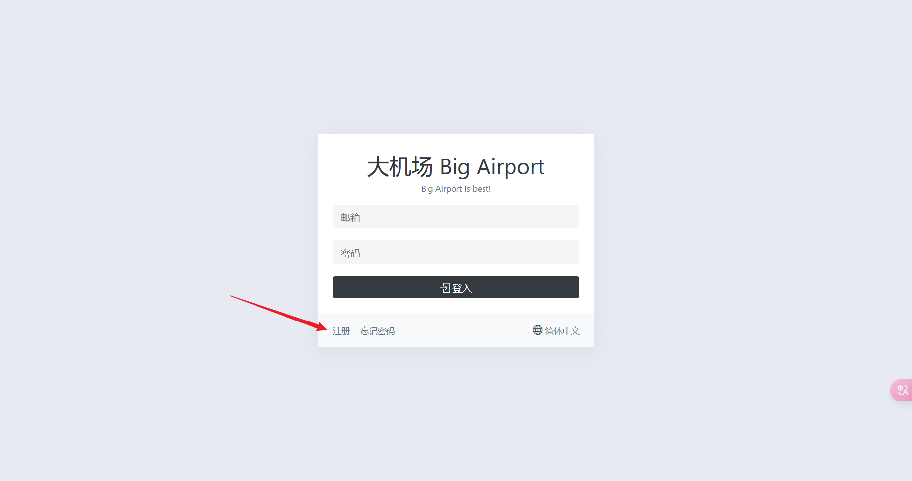
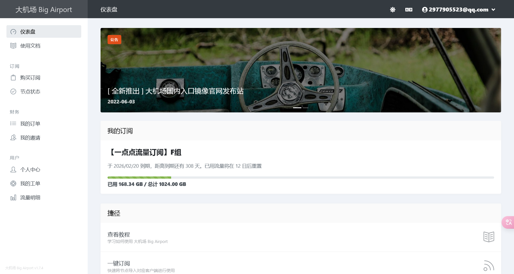
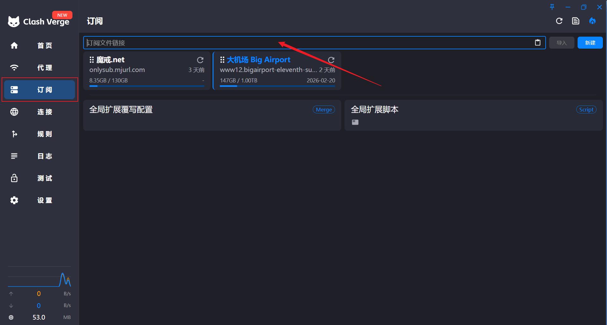
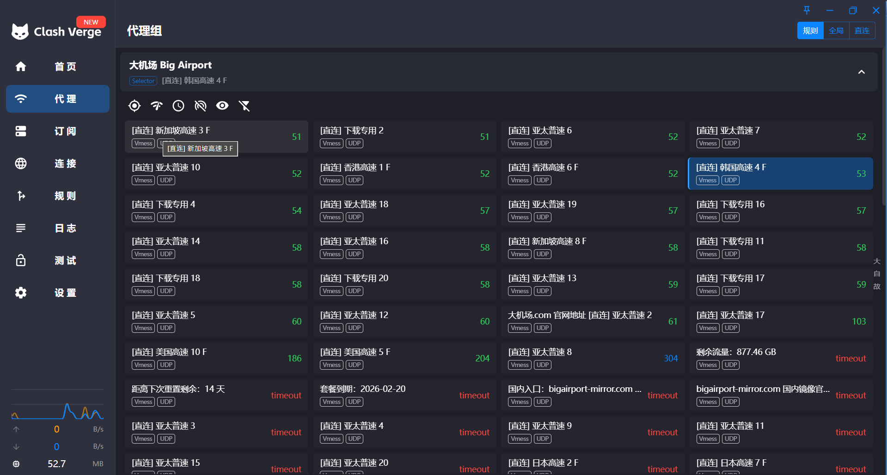

import Callout from '@/components/examples/Callout.astro'

## Intro

I first learned about VPNs and proxy tools around six or seven years ago. 

At the very beginning, I only used them for entertainment. <Callout/ > 

Later I realized they became an important channel for accessing information.

In a closed network environment, information is often limited; meanwhile, the open internet can be noisy, but it also offers valuable resources.

The reason I’m writing this guide is that many people around me still don’t really know how VPNs or proxies work, or they want to use them but don’t know where to start. This article aims to provide a simple introduction.

---

## What Does “Bypassing the Wall” Mean

Cause I also only know a liite about this, I’ll just give you a simple explanation.

When you’re in a country where you can’t access the internet, you can use a VPN or a proxy to bypass the wall.

---

## How to Use

Here’s a step-by-step guide using two providers and common client applications.

First, go to [Big Airport](https://bigairport-mirror.com/) offical mirror site. 

(this is a mirror site, if DNS issues occur, try alternative links).

1. Open the website and register an account with your email and password.

2. After logging in, you’ll see the homepage be like this:

3. Purchase a subscription (the cheapest plan is sufficient for most users) and get your subscription link.

4. Download a client such as **Mihomo Party** or [Clash Verge](https://github.com/clash-verge-rev/clash-verge-rev/releases/tag/v2.2.3).

5. Import the subscription link into the client:

6. Select a node based on your network speed and needs:

> Note: Big Airport is affordable but not always stable. For this reason, I also use [Mojie](https://mojie.me/#/dashboard) as a backup. The setup process is almost identical.

---

## Outro

These are the two main tools I’ve relied on over the years.
If you’d like to explore other options, you can check this [blog](https://clashx.pro/) for more resources and guides.