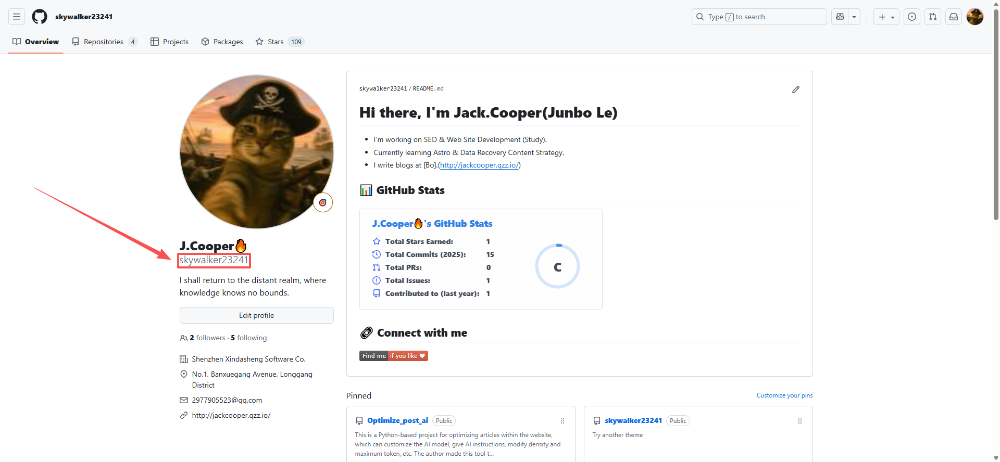
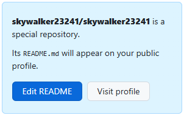

# 影子

起因是我在一些大佬的Github主页看到都是十分高端大气的个人主页资料，然后想要自己也设置一个类似的效果，询问ChatGPT，告诉我只需要在自己的repo中新建一个和自己用户名一致的仓库然后放上ReadME文档即可，于是便有了以下教程，其中我还会加入一些其他美化的方法，感兴趣的朋友可以看看！

# 1. 创建一个和自己用户名相同的Repo

首先，你需要创建一个和用户名相同的仓库，这个仓库的名称就是你的用户名。这里不用担心Repo的名称不可用，因为是你的Github id，已经具有唯一性了。创建仓库的方法在这里就不详细解释了，实在不会可以问问AI，拿我自己来举个例子，我的Github用户名是`skywalker23241`，然后我就可以新建一个repo名为`skywalker23241`,或者你也可以图方便，将自己之前创建过的repo重命名为`你的用户名`。像我就是拿自己博客的Repo直接重命名为`skywalker23241`，因为我不想有太多Repo。用户名一般是你Github昵称下方的一串id。

（[**传送门**](https://github.com/)）

如果你找不到可以参考下方的图片。


# 2. 美化你的Github主页

在完成第一步之后，我们可以先点击进入我们刚刚创建的Repo，你会发现右边有一个蓝色的提示选项！


然后我们就可以创建一个新的ReadME.md文件，里面可以写一些对于自己的介绍，或者是自己想要展示的信息或者多媒体文件。

这个功能我认为对于Github创作者或者IT行业求职者来说很有必要，一方面可以添加一些自己的项目以及获得的成就，另一方面也让Github可以更好的发挥社交属性，或者说是职业属性，可以将它变成你的一份个性MD简历。

MD文档相必大家都并不陌生，一句话来说就是一份可以各种自定义的文本文件，**You can do anything with it**. 放一个ChatGPT生成的模板在这里吧！

```markdown
# Hi there 👋, I'm [Your Name]  

🚀 [Your Role / Tagline] | 🌐 [Your Focus Area] | ✨ [Your Tech Enthusiasm]  

---

## 👨‍💻 About Me  
- 🔭 I’m currently working on **[Current Work / Projects]**  
- 🌱 Exploring **[Learning Topics / Frameworks]**  
- 📝 I write blogs at [My Blog](https://your-blog-link.com)  
- 💡 Passionate about **[Key Interests / Industry Focus]**  
- 🎯 2025 Goal: **[Your Yearly Goal]**  

---

## ⚡ Tech Stack  

**Languages & Frameworks**  
  
  
  
  
  

**Tools & Platforms**  
  
  
  
  

---

## 📈 GitHub Stats  

  
  

---

## 📝 Featured Projects  

- 🔗 [Project One](https://your-project-link.com) — **[Short description of project]**  
- 💾 [Project Two](https://your-project-link.com) — **[Short description of project]**  
- 📚 [Project Three](https://your-project-link.com) — **[Short description of project]**  

---

## 🌍 Connect with Me  

[](https://linkedin.com/in/YOUR_PROFILE)  
[](https://twitter.com/YOUR_HANDLE)  
[](https://your-blog-link.com)  

---

⭐️ From [YOUR_USERNAME](https://github.com/YOUR_USERNAME)

```

这里再放两个大多数developer会选择放在自己的Github主页上的两个小玩意：

1. [Github ReadME Stats](https://github.com/anuraghazra/github-readme-stats )

2. [Shields.io](https://shields.io/)

一个可以用于统计自己的Github数据，另一个可以生成链接小卡片，非常好用！

完成MD文档之后它便会出现在你的Github主页啦！恭喜你！又学会了一项新 ~~没用的~~ 技能！

# 后记

写这篇文章也算是练习下自己使用markdown语法码字的水平 ~~水了一篇博客~~ 吧，也希望大家可以创建出自己喜欢的个人Github主页！欢迎在评论区留言交流！看看你的Github主页长什么样子！

（本文未采用AI编写、润色）