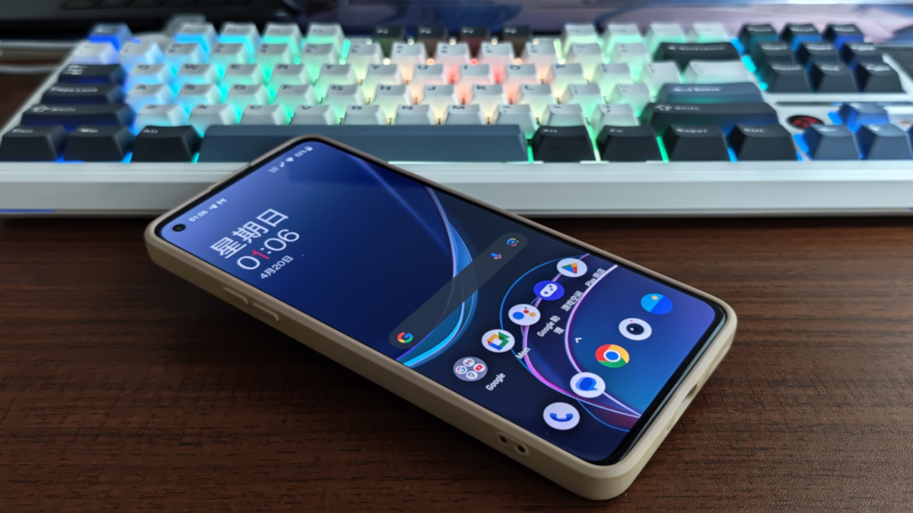

记一次9008线刷OnePlus8T发生的趣事(无聊的事情)

## 影子

周六心血来潮, 想要把自己之前大学用过的那台小一加手机刷回H2OS, 之前老是看大侠阿木的[博客](https://www.daxiaamu.com/), 里面分享了很多关于升降级的教程, 然后自己也想试试, 便有了这篇文章, 过程虽然坎坷了些许, 但是结果总归是好的......

## 为什么要刷机?

原因很简单, 之前用这台手机做为主力机的时候, 一有什么最新的更新就想要安装, 最大的一次更新算是从H2OS更新到ColorOS吧, 那时候觉得新系统当然更加好用, 高效, 到后面却成为了搞笑哈哈哈

(电池的过度消耗带来的续航不足, 系统的优化不足加上硬件有点落后导致的发热, 降频掉帧等原因, 后面去官方维修店换了一块电池, 换的时候觉得焕然一新, 但是现在看来也只是垂死的挣扎罢了, 系统的更新带来的不只有便利, 随之而来的是对旧机型的淘汰, 不然人家怎么挣钱哈哈哈, 说到了维修这一块就一起说了吧, 之前屏幕也找官方的维修服务中心更换过一次, 那次是因为绿线原因导致的, 不过换下来没怎么花钱, 只是路上的交通费用需要我支付, 体验还是不错的, 但是

### **大氢已亡**

再也没有之前的一加了, *Never Settle* 也慢慢成为了一个梗.

## 刷机过程

从周五晚上开始到现在基本上已经完工成果就是:

锁上了Bootlooder(之前不知道怎么搞的解锁了)

从ColorOS 14刷回了 Oxyen OS 10.0.12.12 (9008线刷, rom来自于[大侠阿木的rom资源库](https://yun.daxiaamu.com/OnePlus_Roms/))

其中有几个比较让我头疼的问题就在这里写出来吧, 如果以后有人有一样的问题, 说不定可以看见这篇博客, 带来一点帮助.

我的这台手机情况比较复杂, 应该是之前想要安装Magisk, 然后引入一些有趣的模块而导致解锁Bootloader的, 再我刷机的过程中带来了许多问题.

### 我尝试过的方法

1. 通过本地卡刷来直接降级, 用的工具是[V-AB更新助手](https://yun.daxiaamu.com/files/%E5%B8%B8%E7%94%A8APP/), 直接电脑下载全量包以后导入到这个工具, 最后也是G了, 问题: 包和目前的系统不匹配,无法降级.(卡刷还是需要一点运气的, 如果是升级或者内测的话成功的概率高一点)
2. 变砖失败以后, 通过[大侠阿木的工具箱](https://optool.daxiaamu.com/optool/)切换槽位重新进入之前的ColorOS系统, 然后尝试通过获取root权限, 也就是安装Magisk以及其他模块来刷机.(后面发现其实完全没有用哈哈哈)
3. 然后手机被我第二次搞成砖头了, 卡在了g.co/abh界面, 当时就开始找关于9008刷机的一些方法, 看的最多的就是用MwmDownloadTool来线刷,直接下载9008修复变砖急救包(试了两次,一次是尝试刷入H2OS, 还有一次是ColorOS) 都以失败告终, 原因是系统与机型不兼容, 其实这个问题我一开始就有点忽视了, 最后才重视起来......
4. 最后一次刷机也是去一加官方社区找了一大堆别人刷机成功的帖子, 发现氧OS的一个包的成功率还蛮高的,然后就去试了下, 尝试了ColorOS的官方降级助手, 但是由于手机此时是砖头, 因此也没有什么卵用......而且我还傻傻的把Bootloader锁回去了, 直接导致系统损坏, 也正是这次彻底损坏, 加强了我想要降级的决心.

**"You're Full With Detemination"**

最后就是查了一堆的如何9008线刷的教程, 这里建议去b站找, 实际的案例很多, 搜索你需要的关键词即可.

最后成果刷机, 回到大氧时代哈哈哈, 谷歌全量桶, 可以愉快的"翻墙了"......

## 一些马后炮

我接入com口的方法是:先把设备连接到主板上面的USB端口, 然后按住全部按键, 听见设备连接的声音之后再按住一小会,松开, 此时MWM工具里面的Com口就出来了.

如果是只想要刷入模块的话,建议还是先降级系统, 因为颜色系统的发热实在是太严重了,用了一小会就快要烫死了(我喜欢裸奔)

下载rom包可以去大侠阿木的百度网盘, 他自己的云盘下载速度有点感人哈哈哈, 如果下的不多可以看广告用下载加速券, 如果下的比较多可以买个9.9 下载一天的加速卡, 速度还是比较快的(百度云盘限速sucks)

一定要安装相关的驱动, 像高通的官方驱动, 不安装肯定不会显示com口, 还有就是如果设备管理器没显示com口, 可以换不同的usb口试试, 实在不想可以试试工程线, 部分用户反映很有用, 也算是死马当活马医吧.

## 后记

*刷机有风险, 9008 滚回老家.*

(完) 编辑于:

###### Sun Apr 20 01:03:13 CST 2025
